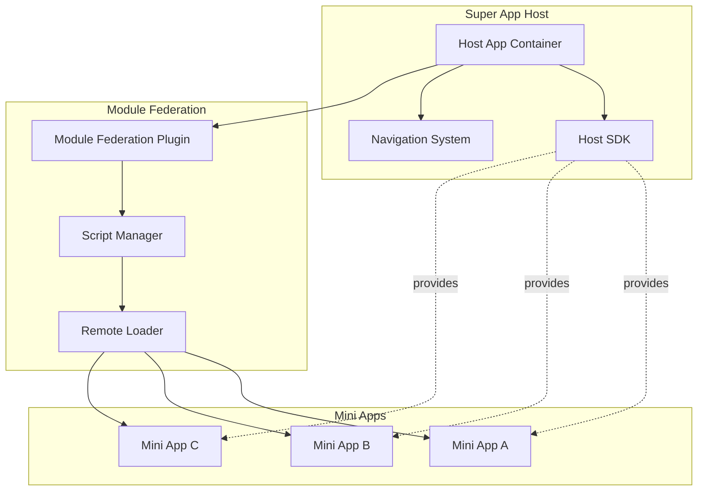
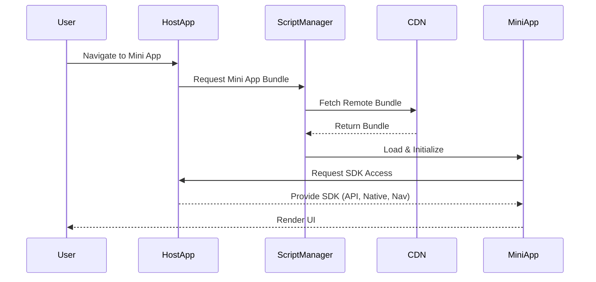
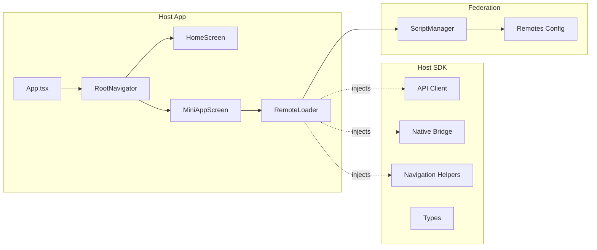

# Super App Host - Documentation

## 📋 Table of Contents

- [Architecture Overview](#architecture-overview)
- [Directory Structure](#directory-structure)
- [Technical Stack](#technical-stack)
- [Getting Started](#getting-started)
- [Development Workflow](#development-workflow)
- [Host SDK](#host-sdk)
- [Module Federation](#module-federation)
- [Deployment](#deployment)

---

## 🏗️ Architecture Overview

### High-Level Architecture



### Module Federation Flow



### Component Architecture



---

## 📁 Directory Structure

```
HostApp/
├── src/
│   ├── federation/              # Module Federation logic
│   │   ├── RemoteLoader.tsx     # Component to load Mini Apps
│   │   ├── ScriptManager.ts     # Manages remote bundle loading
│   │   └── remotes.config.ts    # CDN URLs for Mini Apps
│   │
│   ├── host-sdk/                # SDK for Mini Apps
│   │   ├── api.ts              # API client with auth
│   │   ├── native.ts           # Native capabilities bridge
│   │   ├── navigation.ts       # Navigation helpers
│   │   ├── types.ts            # TypeScript definitions
│   │   └── index.ts            # SDK exports
│   │
│   ├── navigation/              # App navigation
│   │   ├── RootNavigator.tsx   # Main navigator
│   │   └── types.ts            # Navigation types
│   │
│   └── screens/                 # App screens
│       ├── HomeScreen.tsx      # Mini App launcher
│       └── MiniAppScreen.tsx   # Mini App container
│
├── ios/                         # iOS native project
├── android/                     # Android native project
├── rspack.config.mjs           # Rspack + Module Federation config
├── App.tsx                     # Root component
├── index.js                    # Entry point
└── package.json                # Dependencies
```

---

## 🛠️ Technical Stack

### Core Technologies

| Technology | Version | Purpose |
|------------|---------|---------|
| React Native | 0.81.5 | Mobile framework |
| Re.Pack | 5.2.3 | Webpack/Rspack bundler |
| Rspack | Latest | Fast bundler (Rust-based) |
| React Navigation | 7.x | Navigation library |
| TypeScript | 5.x | Type safety |
| Hermes | Default | JavaScript engine |

### Key Dependencies

```json
{
  "@callstack/repack": "^5.2.3",
  "@react-navigation/native": "^7.1.26",
  "@react-navigation/native-stack": "^7.9.0",
  "react-native-screens": "^4.19.0",
  "react-native-safe-area-context": "^5.6.2"
}
```

---

## 🚀 Getting Started

### Prerequisites

- Node.js >= 20
- React Native development environment
- iOS: Xcode, CocoaPods
- Android: Android Studio, JDK

### Installation

```bash
# Clone repository
cd /path/to/super-app-demo

# Install dependencies
npm install

# iOS: Install pods
cd ios && pod install && cd ..

# Start Re.Pack dev server
npm start

# Run on iOS (in another terminal)
npm run ios

# Run on Android
npm run android
```

### First Run

1. Start Re.Pack dev server: `npm start`
2. Launch app: `npm run ios` or `npm run android`
3. You should see the HomeScreen with:
   - Super App Host title
   - Demo User info
   - Available Mini Apps list

---

## 💻 Development Workflow

### Running the App

```bash
# Start Re.Pack dev server
npm start

# In another terminal
npm run ios     # iOS
npm run android # Android
```

### Hot Reload

- **iOS**: `Cmd + R` in simulator
- **Android**: `RR` in terminal or shake device
- **Re.Pack**: Press `r` in dev server terminal

### Building for Production

```bash
# iOS
npm run bundle:ios
cd ios && xcodebuild ...

# Android
npm run bundle:android
cd android && ./gradlew assembleRelease
```

---

## 🔌 Host SDK

The Host SDK provides a controlled interface for Mini Apps to interact with the host.

### API Client

```typescript
import { api } from '../host-sdk';

// GET request
const data = await api.get('/users/profile');

// POST request
const result = await api.post('/orders', { items: [...] });

// PUT request
await api.put('/profile', { name: 'New Name' });

// DELETE request
await api.delete('/items/123');
```

**Features:**
- ✅ Automatic authentication (Bearer token)
- ✅ Error handling
- ✅ TypeScript support

### Native Capabilities

```typescript
import { native } from '../host-sdk';

// Camera
const photo = await native.camera.takePicture();

// Location
const location = await native.location.getCurrentPosition();

// Storage
await native.storage.setItem('key', 'value');
const value = await native.storage.getItem('key');

// Permissions
const granted = await native.permissions.request('camera');
```

**Security:** Mini Apps cannot access native modules directly. All access is controlled through the Host SDK.

### Navigation

```typescript
import { navigation } from '../host-sdk';

// Navigate to another Mini App
navigation.navigateToMiniApp('miniAppB');

// Go back
navigation.goBack();

// Navigate to Home
navigation.navigateToHome();
```

### Mini App Contract

Every Mini App must implement this interface:

```typescript
interface MiniAppProps {
  userToken: string;
  userInfo: {
    id: string;
    name: string;
  };
  theme: 'light' | 'dark';
  language: string;
}

export default function MiniApp(props: MiniAppProps) {
  // Your Mini App code
  return <View>...</View>;
}
```

---

## 🔗 Module Federation

### Configuration

File: [rspack.config.mjs](file:///Users/malco/Documents/super-app-demo/rspack.config.mjs)

```javascript
new Repack.plugins.ModuleFederationPlugin({
  name: 'HostApp',
  remotes: {
    // Dynamic remotes resolved at runtime
  },
  shared: {
    react: { singleton: true, eager: true },
    'react-native': { singleton: true, eager: true },
    '@react-navigation/native': { singleton: true, eager: true },
    '@react-navigation/native-stack': { singleton: true, eager: true },
  },
})
```

### Remote Configuration

File: [src/federation/remotes.config.ts](file:///Users/malco/Documents/super-app-demo/src/federation/remotes.config.ts)

```typescript
export const REMOTES = {
  miniAppA: {
    dev: 'http://localhost:9001/miniAppA.container.bundle',
    prod: 'https://cdn.superapp.com/mini-apps/app-a/latest/miniAppA.container.bundle',
  },
  miniAppB: {
    dev: 'http://localhost:9002/miniAppB.container.bundle',
    prod: 'https://cdn.superapp.com/mini-apps/app-b/latest/miniAppB.container.bundle',
  },
};
```

### Loading Mini Apps

```typescript
// In MiniAppScreen.tsx
<RemoteLoader
  appName="miniAppA"
  userToken={userToken}
  userInfo={userInfo}
  theme="light"
  language="vi"
/>
```

---

## 🚢 Deployment

### Host App Deployment

**iOS:**
```bash
# Build production bundle
npm run bundle:ios

# Build in Xcode
cd ios
xcodebuild -workspace HostApp.xcworkspace \
  -scheme HostApp \
  -configuration Release \
  archive
```

**Android:**
```bash
# Build production bundle
npm run bundle:android

# Build APK/AAB
cd android
./gradlew assembleRelease
# or
./gradlew bundleRelease
```

### Mini App Deployment

1. **Build Mini App:**
   ```bash
   cd MiniAppA
   npm run bundle
   ```

2. **Upload to CDN:**
   ```bash
   aws s3 cp build/ s3://cdn.superapp.com/mini-apps/app-a/v1.0.0/ --recursive
   ```

3. **Update Host Config:**
   Update `remotes.config.ts` with new CDN URL

4. **Deploy:** Mini App updates are instant (no app store review needed!)

---

## 📊 Performance Considerations

### Bundle Size

- **Host App:** ~2-3 MB (base bundle)
- **Mini App:** ~500 KB - 1 MB each
- **Shared Deps:** Loaded once, shared across all Mini Apps

### Loading Strategy

- **Eager:** Core dependencies (React, React Native)
- **Lazy:** Mini Apps loaded on-demand
- **Caching:** Remote bundles cached on device

### Optimization Tips

1. **Code Splitting:** Split large Mini Apps into chunks
2. **Tree Shaking:** Remove unused code
3. **Compression:** Enable gzip on CDN
4. **Prefetching:** Preload frequently used Mini Apps

---

## 🐛 Troubleshooting

### Common Issues

**1. RNSScreenStack Error**
```bash
cd ios && pod install && cd ..
npm run ios
```

**2. Module Not Found**
- Check import paths (use relative paths, not `@/`)
- Restart Re.Pack dev server

**3. Bundle Loading Failed**
- Verify CDN URL in `remotes.config.ts`
- Check network connectivity
- Ensure Mini App is deployed

**4. TypeScript Errors**
- Run `npm run tsc` to check types
- Ensure `tsconfig.json` is correct

---

## 📚 Additional Resources

- [Re.Pack Documentation](https://re-pack.dev/)
- [Module Federation](https://webpack.js.org/concepts/module-federation/)
- [React Navigation](https://reactnavigation.org/)
- [React Native](https://reactnative.dev/)

---

## 📄 License

MIT License
