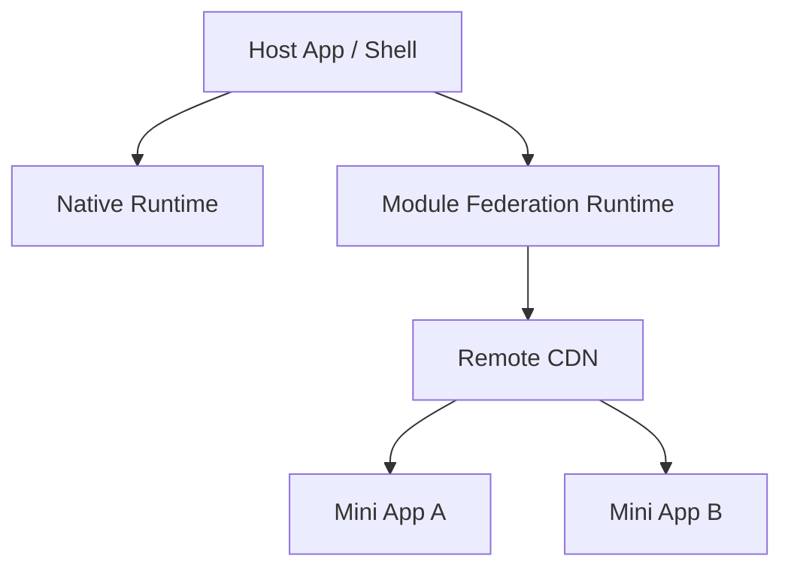

# Host App Architecture: React Native Super App (Micro-frontends)

**Author:** Malco  
**Tech Stack:** React Native, Expo (Prebuild), Re.Pack (Webpack), Module Federation  
**Last Updated:** 2026-01-08

---

## 1. Overview

Host App (Shell / Container App) là nền tảng cốt lõi của Super App. Nó chịu trách nhiệm cung cấp môi trường runtime, native capabilities và cơ chế tải Mini Apps động thông qua Module Federation.

**Trách nhiệm chính:**

- Quản lý lifecycle ứng dụng (launch, background, foreground)
- Cung cấp Native Modules & SDK dùng chung
- Tải & cache Mini App bundles từ xa (OTA)
- Chia sẻ core libraries (React, React Native, Navigation)

---

## 2. Architecture Diagram



---

## 3. Directory Structure

```text
host-app/
├── android/
├── ios/
├── webpack.config.mjs
├── app.json
├── package.json
├── index.js
└── src/
    ├── navigation/
    ├── federation/
    │   ├── ScriptManager.ts
    │   └── RemoteLoader.tsx
    ├── services/
    ├── host-sdk/
    │   ├── api.ts
    │   ├── native.ts
    │   └── navigation.ts
    └── App.tsx
```

---

## 4. Technical Configuration

### 4.1 Expo & Native Setup

- Sử dụng `expo-dev-client`
- Chạy `npx expo prebuild`
- Entry point: `index.js`

### 4.2 Webpack & Module Federation

```ts
new ModuleFederationPlugin({
  name: 'HostApp',
  remotes: {
    miniAppA: 'miniAppA@dynamic',
    miniAppB: 'miniAppB@dynamic',
  },
  shared: {
    react: { singleton: true },
    'react-native': { singleton: true },
    '@react-navigation/native': { singleton: true },
    '@host/sdk': { singleton: true },
  },
});
```

---

## 5. Dynamic Script Manager

```ts
ScriptManager.shared.addResolver(async (scriptId) => {
  const env = __DEV__ ? 'dev' : 'prod';
  return {
    url: REMOTES[scriptId][env],
    cache: !__DEV__,
  };
});
```

---

## 6. Host SDK Contract

Mini Apps **không được phép** sử dụng native modules trực tiếp.

### Props Injected to Mini App

```ts
interface MiniAppProps {
  userToken: string;
  userInfo: { id: string; name: string };
  theme: 'light' | 'dark';
  language: 'vi' | 'en';
}
```

---

## 7. CI/CD Strategy

### Host App

- Release khi có thay đổi native
- Build `.ipa` / `.aab`
- Tần suất thấp

### Mini Apps

- Build Webpack bundles
- Upload CDN
- Release OTA
- Tần suất cao

---

## 8. Best Practices

- Mini App assets load qua CDN
- Host giữ NavigationContainer
- Mini App bọc ErrorBoundary
- Dùng Monorepo để share types
